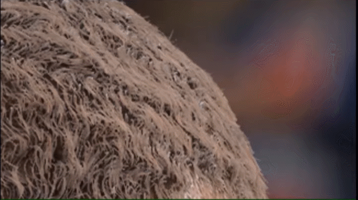
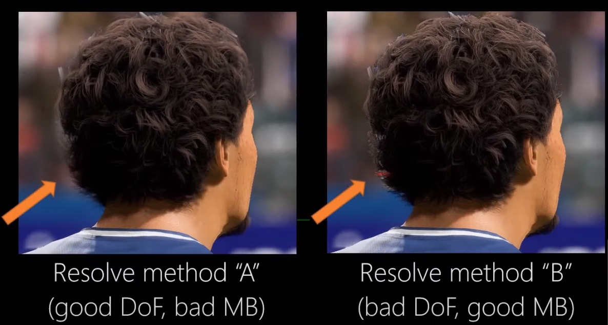

# 马尾
## 模拟
对于这种类型的资产，钟摆效应（Pendulum effects）最为明显，这符合现实生活中的表现。无论头部的朝向如何，马尾可以在维持原始形状的情况下自由旋转。对于这种类型的资产，本文使用了大量的时间来改进局部形状约束。   

局部形状约束尝试在线段的父节点空间维持其朝向，而非世界空间。在这个步骤之前，我们需要花费一些时间来计算每个线段在其父节点空间的目标，局部形状约束实际上就是要尝试去匹配这个目标。

图示是在局部空间（父节点空间）进行形状约束。

图示是在世界空间进行形状约束。   
二者的区别在于：在局部空间维持形状，意味着约束角度是根据当前位置计算出来的；在世界空间维持形状，意味着约束角度是根据原始位置计算出来的。
## 渲染

在渲染部分，马尾变成了一个意料之外的难题。在此之前阐述过，精光栅化在tile中工作，发射出一些并行独立的处理单元，也就是处理器，每个处理器从一个全局队列中消费（consume）tile。消费这些tile的顺序是随机的，所以帧与帧之间有一些耗时（Timings）差异是可以预期的。但实际上，耗时差异比预期大了很多，某些帧花费了其他帧接近两倍的时间。   

查看调试信息，可以看到某些tile需要花费比其他tile长很多的时间来处理。如果一个tile包含了很多线段，逻辑上确实需要更长的时间来处理。但是如果个别耗时大的tile在队列的尾部，那么就会造成某些处理器是忙碌状态，而GPU其他部分都是空闲状态。   

一个简单的方法可以解决这个问题，对队列中的tile根据包含的线段数量进行预排序。这样，耗时最大的一些tile被首先处理，而在队列的尾部都是一些耗时小的tile，这就很容易进行分配了。这就意味着耗时上更加稳定，而且这也是一个重大的性能提升。

想象一下马尾是什么样的：把几乎所有的发丝都抓起来，然后把它们绑在一起。如果一个人的头发有十万根，那么马尾的开始部分是一个很小的区域，但是却包含了很多发丝。这也就意味着，少数屏幕空间tile中包含了数万个线段。

为了解决这个问题，本文不再是只在两个维度上划分tile，而是增加了深度簇来划分视椎素（froxel）。这样做的好处在于，精光栅化可以从前到后处理每个簇，当它达到不透明时（Alpha=1），那么就停止处理后面的线段。

我们可以在像素级别上进行这个操作，也可以在tile级别上进行。当整个tile都到达不透明时，精光栅就可以停止处理tile中的所有线段了。在适应马尾的最差情况下，这个方法可以提供超过4倍的性能提升。
# 卷发
## 模拟

卷发的解算并不好做，我们期望看到发丝的一些动作，同时头发整体还需要维持它的形状。对于这种发型，本文更多地依赖摩擦力和体积保持，并且会将局部形状约束的因子调得很大。实际上，为了支持那些非常弯曲的发丝，局部形状约束被进一步改进，本文不得不引入了非常激进的稳定化技术（个人猜测：全局形状约束）。为了得到块状移动（bulk motion），本文还很大地依赖了插值。我们并不真的需要看到个别的发丝移动，因为块状移动已经够用了。所以本文只对渲染发丝的2%进行了物理模拟。
## 渲染
为了得到很好的弯曲头发，我们需要对它进行大量的细分，但是这样会大量增加模拟的消耗。理想情况下，需要对头发进行某种类似于GPU上的曲面细分阶段的处理，但是在（旧的）架构下，如何在维持较好的性能下去实现这个方法，并不是很清晰。软光栅的架构提供了大量的自由度，所以我们可以尝试实现类似的东西。   

将头发上的顶点视为样条线的控制点，我们就可以对它进行任意程度的细分。在软光栅自身的内循环中进行细分，这样速度就可以非常快。

使用这种方式，我们就去除了以前的硬角，得到了非常平滑的曲线。这样改进了卷发角色的渲染效果，但是性能消耗并没有增大很多。
# 头带
## 模拟
在此之前，我们并没有支持任何头饰，当我们被要求支持发带的时候，这貌似挺难的。我们一开始尝试让内容制作者将头发分成两个部分，头带下面的那部分照常进行物理模拟，头带上面的那部分只进行蒙皮计算。

看起来还不错，但是我们觉得我们可以做到更好。

本文使用了一个非常简单的方法来处理这种情况，虽然需要修复一些边角案例（corner case），但是它效果很好。对于头发的一些特定部分，把发丝的最后一个点也进行蒙皮，并且调整物理模拟来支持这种案例。

使用这种方法，我们可以看到头顶的一些发丝也在轻微的移动。
## 渲染
在运行时渲染头发这种半透明物体时，会有一系列问题。而渲染发带暴露了这些问题中的一个小问题。

在渲染头发的时候，我们需要选择在渲染帧中的那个点将头发整合到主RT中。理想情况下，我们可以按照正确的排序从后到前地将头发合并到剩下的半透明物体上。然而这并不现实，所以我们选择在半透明物体之后渲染头发，在某些情况下会遗留下错误的排序。但是在TAA之前还是之后进行合并头发，仍然是个问题。软光栅提供了很好的抗锯齿头发，所以理论上我们不需要TAA再对头发进行任何处理。但是在TAA之后合并头发，就会遇到一个难题。

在TAA执行之前，需要每一帧对相机进行随机抖动（jitter），然后TAA对前几帧进行累加，然后得到一个平滑的无抖动（jitter-free）的图像。所以我们可以在TAA之后渲染头发，而不进行抖动。然而，TAA虽然移除了颜色buffer的抖动，但是并没有很好的方法将深度buffer的抖动移除。这就意味着，在TAA之后渲染头发，虽然不会被抖动，但是会跟抖动过的深度buffer进行深度测试。

这就造成了头发和几何体（例如发带）相交处的Z fighting（没有讲怎么解决，个人猜测是把头发放到TAA之前渲染，因为之前渲染部分提到了：为了TAA和动态模糊能正确的执行，我们还需要生成头发的motion vector）。   

这还没完，根据在哪个点合并头发，我们可以获得好的景深效果、动态模糊或者排序，但是我们并不能兼而有之，每个合并头发的方法都需要一些妥协。所以我们把选择暴露给了灯光美术，他们可以选择需求结算方法，获得好的景深和差的动态模糊，或者差的景深和好的动态模糊。虽然不太理想，但是可以允许我们很好地隐藏掉最刺眼的问题。   
半透明渲染是个非常难的问题，如果想获得更多的信息，可以看一看Morgan McGuire 2016年的演讲（Peering Through a Glass, Darkly at the Future of Real-Time Transparency）。

# 参考文献
* https://www.youtube.com/watch?v=ool2E8SQPGU
* http://advances.realtimerendering.com/s2019/hair_presentation_final.pptx
* [Peering Through a Glass, Darkly at the Future of Real-Time Transparency](https://casual-effects.com/research/McGuire2016Darkly/index.html)