# 发丝的定义
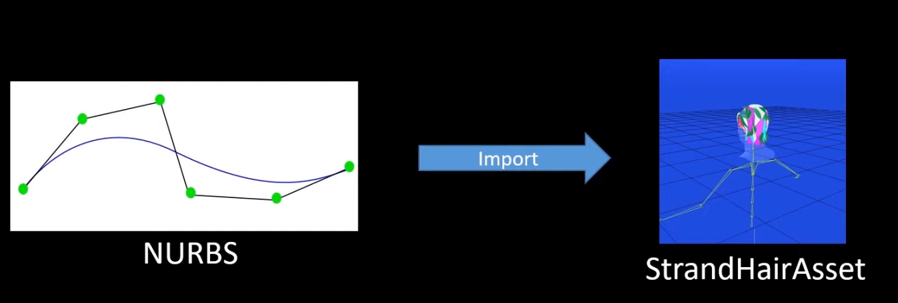
首先是数据来源，发丝以NURBS的形式导入引擎。
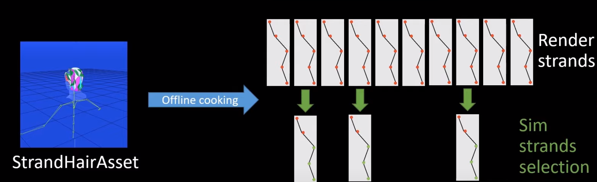
在离线数据管线中，我们将这些NURBS细分成多个点/线段。这些以点/线段组成的曲线，就是我们要渲染到屏幕上的发丝。然后，从这些发丝中，选取一部分作为模拟发丝。曲线上点多了，可以提升模拟的质量，但是也提升了消耗，所以在资产层面上对每根发丝的顶点数进行限制，在3到32之间。
# 概述
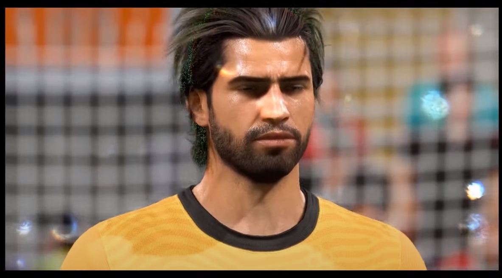
上图，绿色的为模拟发丝。
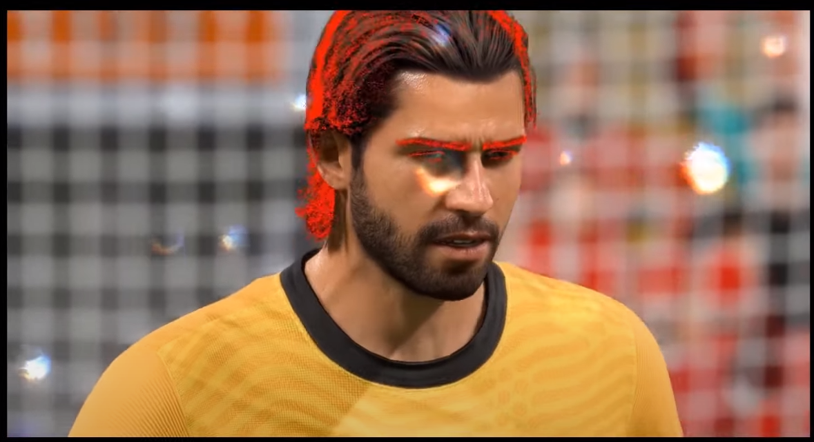
上图，红色的为渲染发丝。对模拟发丝之间进行插值，获得渲染发丝的位移值。   
本文，模拟是完全基于GPU的，使用了欧拉-拉格朗日方法。
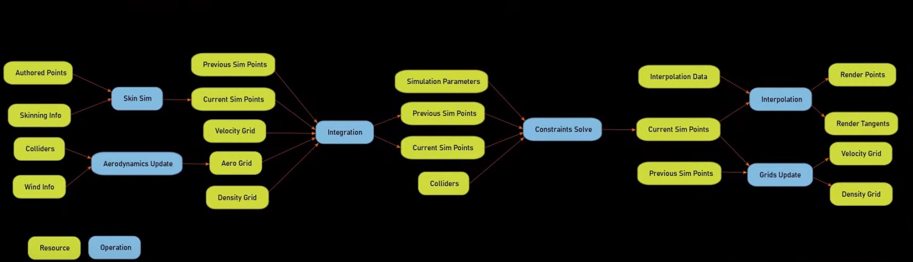
这是一张概述图，虽然没有包含所有的计算着色器和数据，但是对大概的流程很有帮助。首先是对部分点进行蒙皮计算，然后是对所有的模拟发丝进行积分和约束解算，然后插值得到渲染发丝的位置。   
# 蒙皮
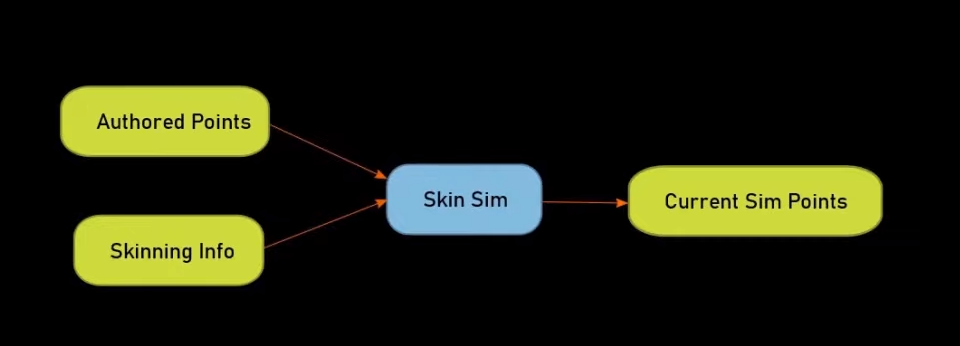
这里，对模拟发丝上第一个线段上的两个点进行经典蒙皮计算。通常，使用头部骨骼对发丝进行蒙皮。对第一个线段而非第一个顶点进行蒙皮，能更好地维持原始形状。   
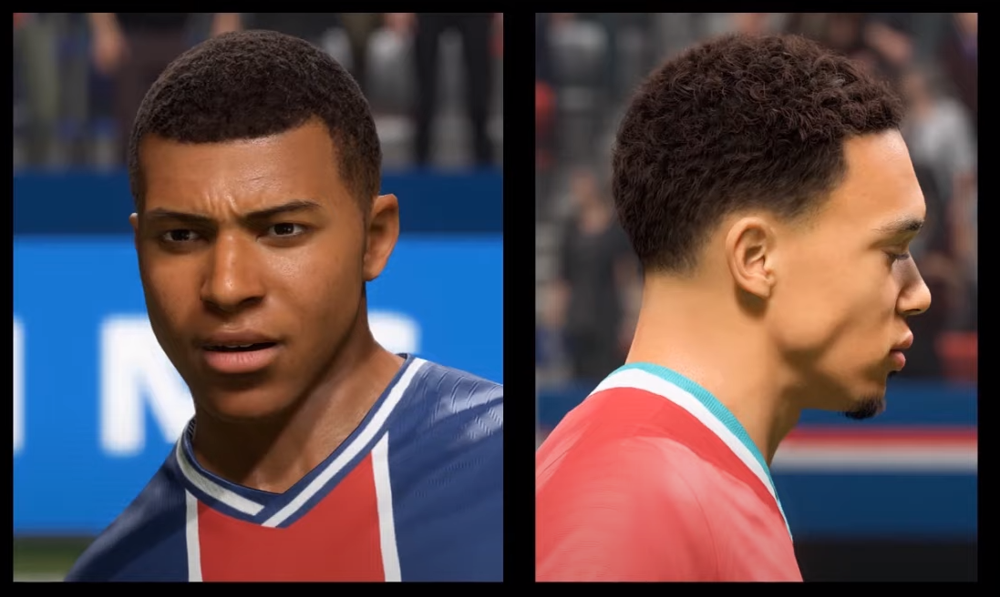
不过对短发来说，对所有点进行蒙皮就已经够用了。
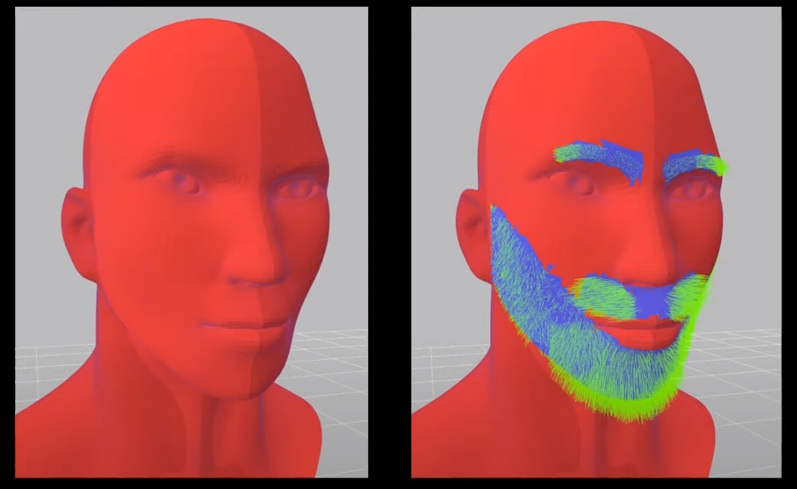
本文同样支持发丝跟随脸部三角面进行移动，虽然消耗略微提升，但是可以允许发丝紧密地跟随表情动画进行移动，而且不需要排除任何与模拟相关的东西。为了实现这个效果，需要在头部mesh上找出与发根点最近的三角面，这个过程相对比较耗，所以是离线计算的。上面，左图是头部mesh，用红色表示，右图中，发丝的第一个线段用绿色表示，被距离发根点最近的三角面用蓝色表示。
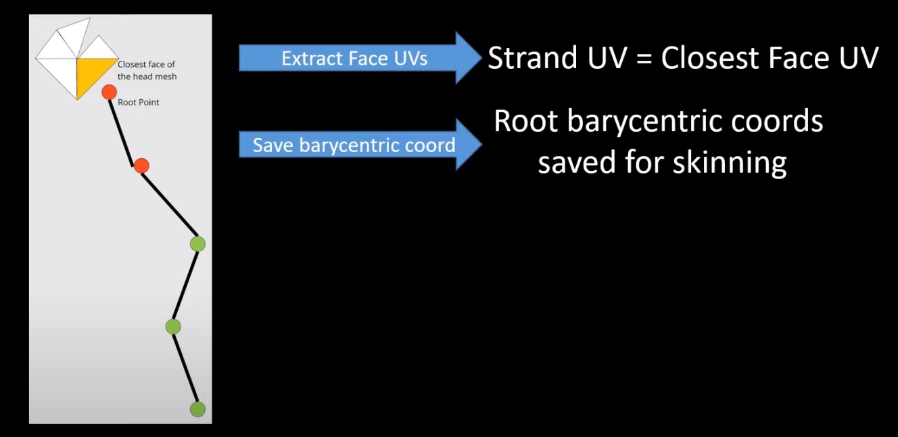
找到了最近的三角面，也就获取发根点的各种uv，并计算重心坐标。uv可以用来采样贴图，例如，获取发丝的色彩值。运行时，不再使用经典的蒙皮着色器，而是通过发根点在重心坐标系上的位移来计算。
# 积分
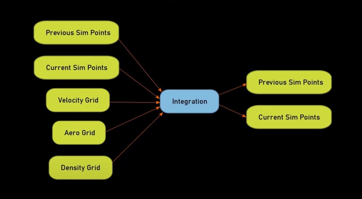
本文使用了基于坐标和Verlet积分的动力学解算器。通常在游戏物理中，并不在一个耦合系统（coupled system）中解算所有的动力学。本文将动力学解算分割成积分和和约束两个部分。   
在积分步骤中，点被视为自由体，无视所有点之间的约束，只是简单地对点施加外力，例如重力。传递给时间步长或者时间差值可以是可变的（Verlet积分要求时间步长是固定的），不过本文不做深入讨论。   
对于常规Verlet积分，本文使用点在前一帧的位置和当前帧的位置来确定它的弹道运动（ballistic motion）。将弹道运动和外力施加到点上来计算新的坐标。不过在这个阶段，Euler部分也会参与进来。外力不仅是重力，而且来自于一些通过体素（grid）累加起来的物理量，例如平均速度和平均密度，用来计算摩擦力和体积保持（volume preservation）。
## 摩擦力
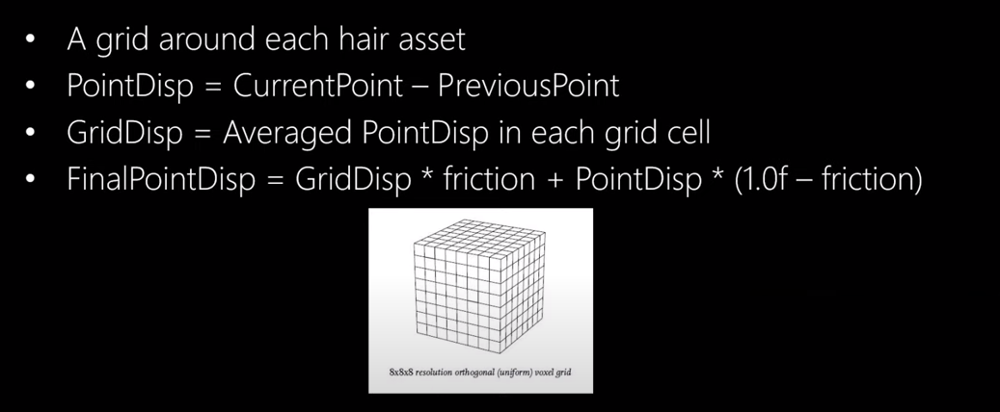
现实中，摩擦力是头发表现的一个重要驱动。不过在实时计算中，对每根模拟发丝之间的摩擦力进行建模消耗太大。本文使用了基于体素的替代方法，对每个体素中的所有的位移进行平均，作为体素的位移（grid displacement）。然后使用资产的摩擦力参数，来对点的弹道运动和体素位移进行插值，获取点的最终坐标。   

上图中，左边为常规摩擦力，右边为高摩擦力。   

上图中，将体素的平均速度显示为色彩值，作为调试信息输出到屏幕上。
## 体积保持
使用相同的方法，本文使用密度体素来摹拟体积保持。将每个点的密度梯度作为外力参与计算。   

上图中，将体积保持因子增大到11，可以看到这些头发尝试去维持一个比之前更大的体积。
# 约束
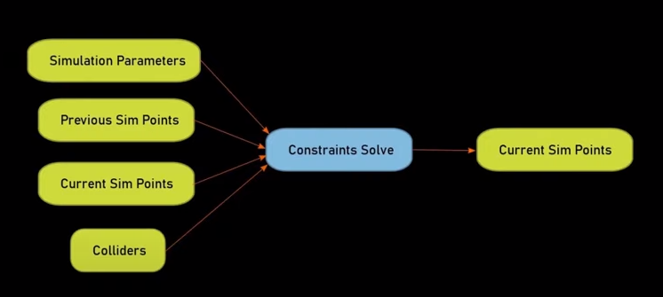
积分完成之后，它的结果作为输入传递给投影约束解算器，用来解决积分部分没有解决的问题。本文简单地移动受影响的点，让他们满足约束条件。不过，约束之间相互冲突，所以我们需要在同一个步骤中多次解算同一个约束。   
## 伸缩

伸缩约束尝试维持线段的原始长度，太远的拉近，太近的拉远。
## 局部形状
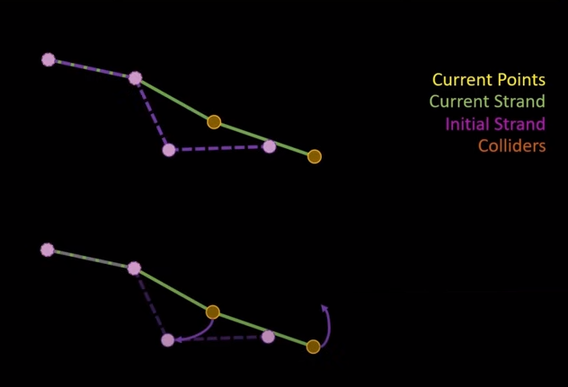
本文中最有意思的约束就是局部形状约束，这里做一个简介，后面会详细介绍（案例研究部分）。局部形状约束的目的是为了维持原始发型。为了达到这个目标，约束器尝试维持线段相对于其父节点（发根方向上的前一个线段）的朝向。与伸缩约束相同，父节点（前一个点/前一个线段）和子节点（当前点/当前线段）都会被移动。
## 全局长度
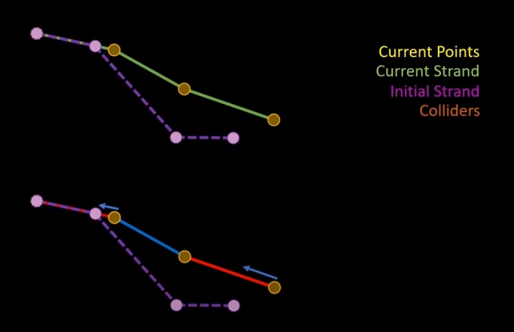
全局长度约束是跟物理没什么关系，本文通常对它使用一个很小的因子。不过有些时候，它对修复（过度）伸缩很有作用。它只是简单的将点拉向它的父节点（发根方向上的前一个点），而父节点并不移动。这是一个跟随领导的方法（follow the leader approach），如果使用过高的因子，会造成反弹行为（GPU Pro 5上做过讨论）。
## 碰撞
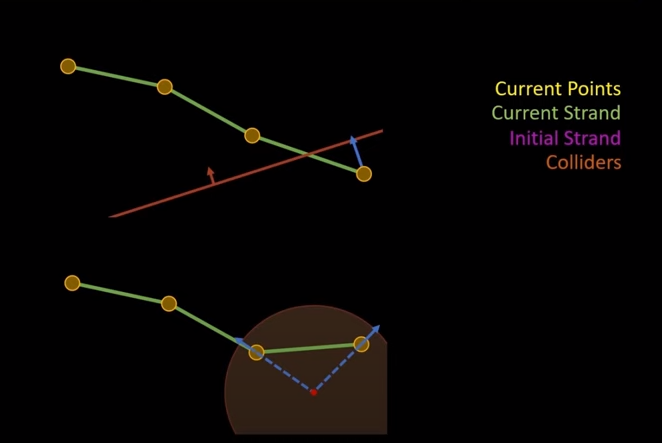
最后，将碰撞体内的点移出来。
## 迭代次数
迭代次数是资产上的一个参数，一般取决于每根发丝上线段的数量，通常在3到10之间。
# 插值
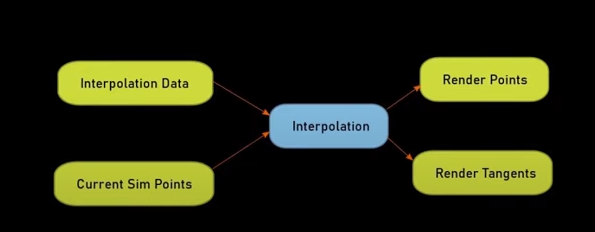
在插值阶段，我们遍历所有的渲染发丝，对三根模拟发丝进行插值，计算出点的位置。这三根模拟发丝及其插值权重，是在离线中基于距离来选取和计算的。使用这个简单的方案，我们不需要模拟太多的发丝，一般来说10%的模拟发丝就够用了。

# 参考文献
* https://www.youtube.com/watch?v=ool2E8SQPGU
* http://advances.realtimerendering.com/s2019/hair_presentation_final.pptx
* Hair Simulation in TressFX. GPU Pro 5.