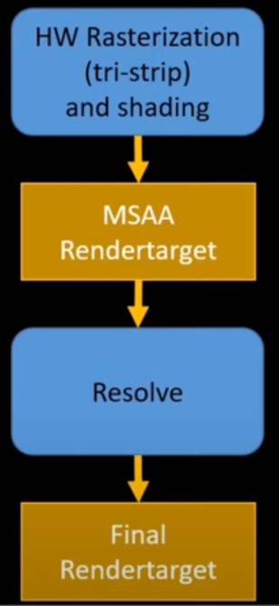
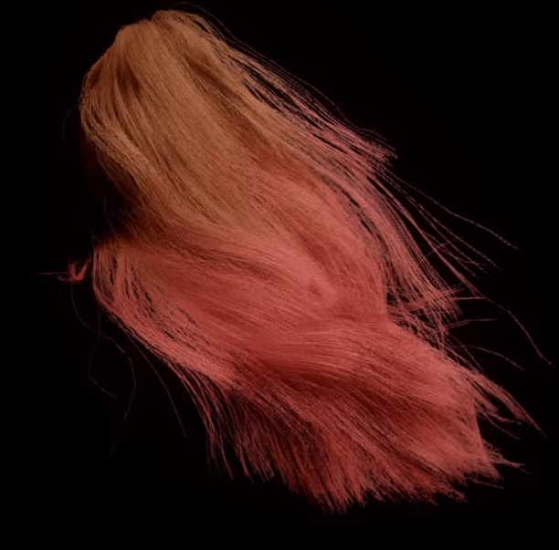
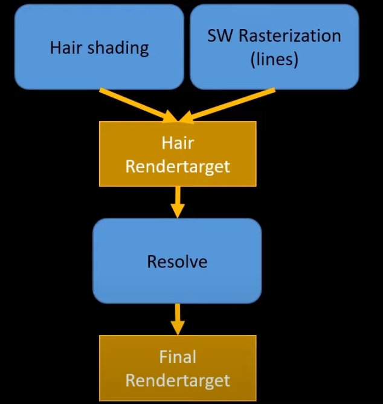
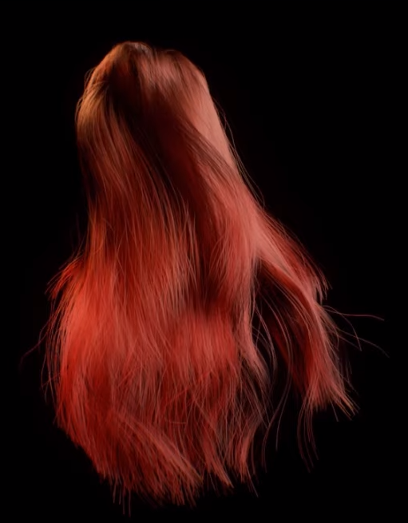
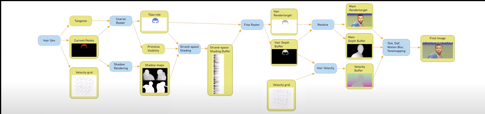
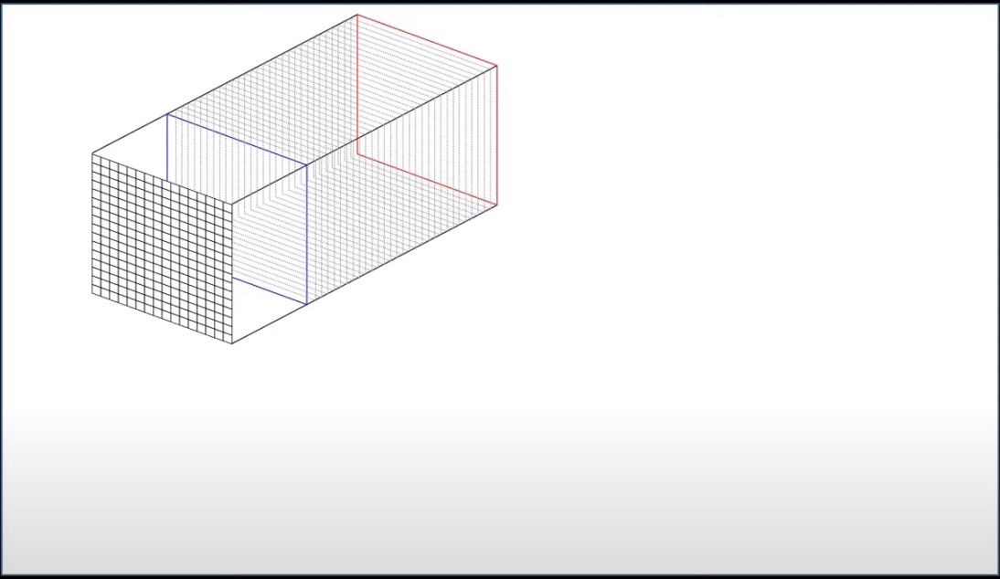
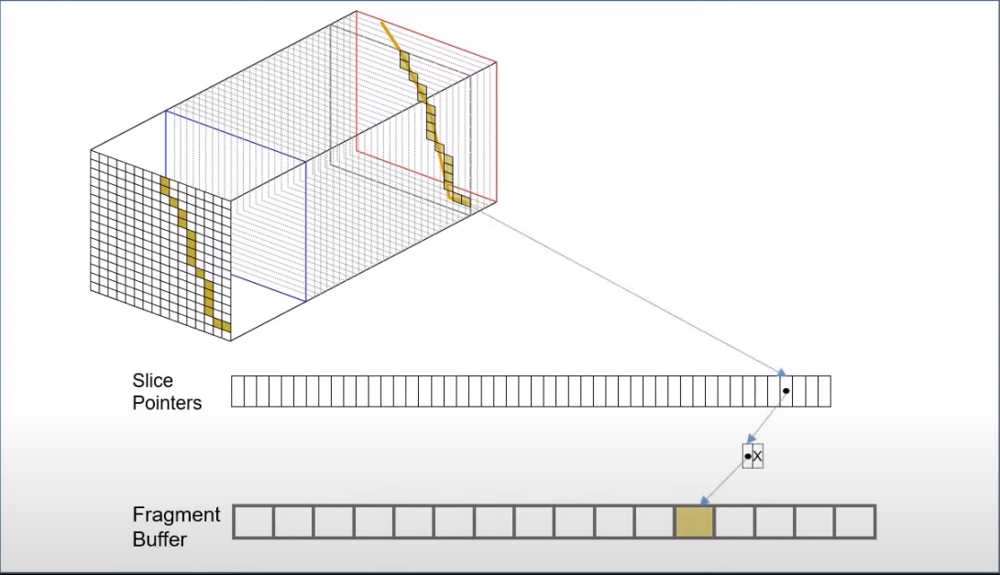
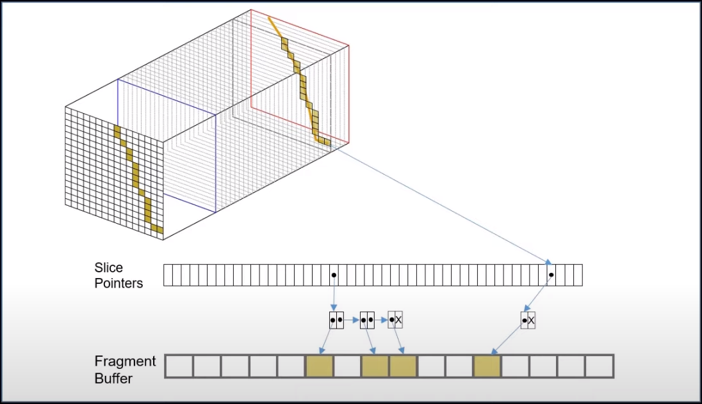
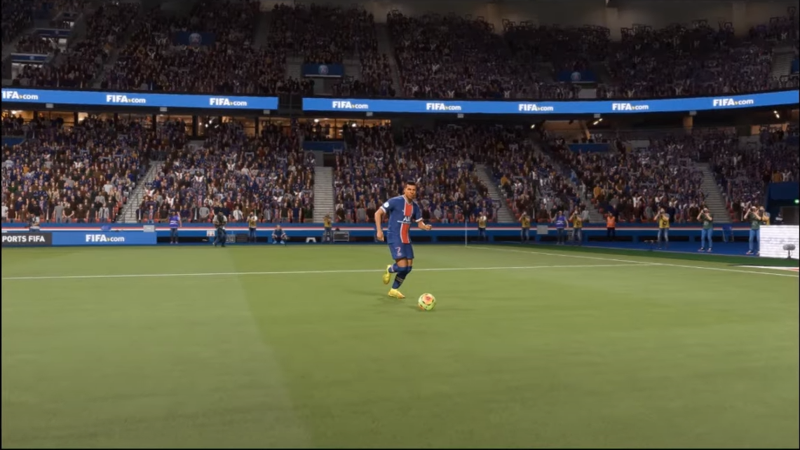
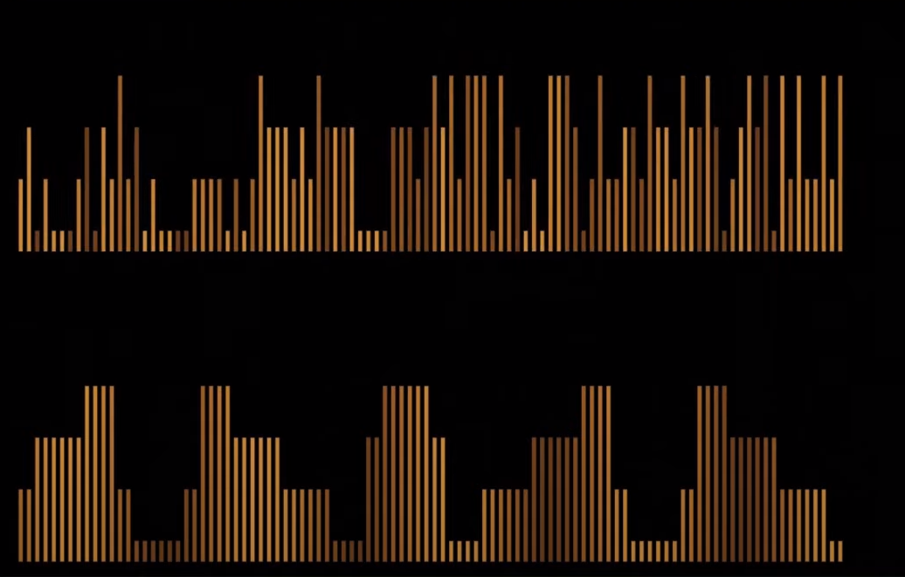

# 新旧对比
## 旧管线

在旧管线中，将每根发丝转换成面向相机的三角带，并依赖于MSAA来进行抗锯齿（MSAA+VisibilityBuffer）。不幸的是，GPU并不喜欢渲染细长的三角面，所以效率并不怎么好。而且坦率地说，效果也不怎么好。  

图片中的头发使用了旧管线来渲染，已经比插片头发好很多了，但是还是比影视中的还是差很多。   
所以我们重构了架构，来改进效果和效率。
## 新管线

新的管线使用了基于计算着色器的软光栅化，这样可以更自由地实现想要的东西。   

新的管线实现了两个重要的特性：
### 分析型抗锯齿
计算像素被发丝覆盖了多少部分，以此来计算发丝的alpha值。使用这种方法，可以很好的去除噪点。   
不过，我们仍然需要一种方法来对头发进行合成，否则效果还是不对的。
### 顺序无关的半透明渲染
因为使用了基于计算着色器的软光栅，所以不能依赖硬件对头发片元进行混合。所以我们只能自己实现混合策略，用逐像素透射函数（per pixel transmittance function）来实现OIT。   
并且在动作中，仍然能保持图像的平滑度，所以我们可以得到平滑柔软且噪点少的流动头发。   
# 新管线概述

## 物理模拟
头发物理模拟生成了每根发丝的位置、朝向（即切线）和速度，用来作为渲染管线的输入。
## 阴影绘制
阴影绘制包含了常规的Shadowmap和Deep Opacity Maps（用于实现自阴影/双重散射）。
## 粗光栅化（Coarse Rasterizer）
将头发线段传入到屏幕空间tile里，并对每个tile生成一个线段列表。同时会执行一个粗略的z culling，剔除掉几何体后面的线段。最后将二值化的可见性缓存起来。
## 发丝空间着色（Strand-space Shading）
着色还是基于Marschner的模型，没有太大变化。但是调用它的方法变了，放弃了逐像素或逐片元（MSAA）的着色方式，现在是将每个发丝分割成数个着色点，只对这些点进行着色，然后再进行插值。与贴图空间着色类似，只不过是一维的。在测试中，这种方式与逐片元的着色差异很小。而且在特写镜头，这种方式比旧管线提升了很多性能。并且未来可以根据相机距离，来控制线段上着色点的数量。着色pass同样使用了粗光栅化生成的可见性信息，这样就可以节省overdraw。   
## 精光栅化（Fine Rasterizer）
对tile上的线段逐个进行光栅化，检查tile中的像素被哪些线段覆盖，并对他们生成最终的色彩值。首先对每个发丝进行分析型抗锯齿（也就是计算alpha），将它们和着色buffer中的信息组合在一起，最后使用OIT将这些线段的色彩值整合成一个色彩值。最后将色彩值深度值输出到两个RT中。   
## 计算头发速度
为了TAA和动态模糊能正确的执行，我们还需要生成头发的motion vector。利用深度信息将像素重投影（reproject）到世界空间。根据世界空间坐标在速度体素（Velocity grid）中获得头发的近似速度。因为速度体素的分辨率并不是特别高，所以这里得到的速度只是近似的，但是足够用了。这样可以避免缓存头发前一帧的位置，可以节省很多内存和效率。
## 结算
将头发RT和深度buffer合并到主RT和深度buffer中去，然后就可以继续常规的渲染流程。
# 顺序无关的半透明渲染
为了得到好看的头发，需要正确地混合这些半透明的发丝。这里使用了一种契合软光栅的自定义OIT方法。

粗光栅跟踪了每个tile上线段和相机之间最近和最远的距离。在精光栅的时候，在深度方向上将这个区间分割成很多切片。

然后遍历tile上所有的线段，对被覆盖的像素生成颜色片元，并存储到一个很大的buffer里。并且将它的“指针”（pointer）保存到链表里。（图示中的Slice Pointers并不是链表，而是一个数组，数组的大小对应切片的数量，数组中的元素是链表，链表的元素指向片元Buffer中的元素）   
当所有被线段覆盖的像素的色彩值都生成完毕时，我们从前向后遍历这些切片，并正确的将这些片元混合在一起。当遍历这些切片的时候，软光栅计算像素的累积透射函数（accumulated transmittacne function），用它来和下一个片元进行混合。   

在一个切片包含多个片元的情况下，因为没有额外的深度信息来决定混合顺序，所以我们只是对它们进行alpha blend。虽然技术上是错误的，但是因为在世界空间中切片是极小的，所以只是在毫米量级下排序是错误的，而大体上，头发仍然是被正确排序的，瑕疵很难被发现。
# LOD

如果角色只是覆盖了屏幕上很小的比率，那么我们渲染成千上万的发丝将变得没有意义。所以需要一种方法，根据屏幕覆盖率，只渲染一定比率的发丝。

首先对发丝的顺序进行随机，然后只渲染前面一部分发丝，这样就得到一种可以根据距离进行线性缩放的加载机制。对于肉眼，几乎是不可见的。

# 参考文献
* https://www.youtube.com/watch?v=ool2E8SQPGU
* http://advances.realtimerendering.com/s2019/hair_presentation_final.pptx