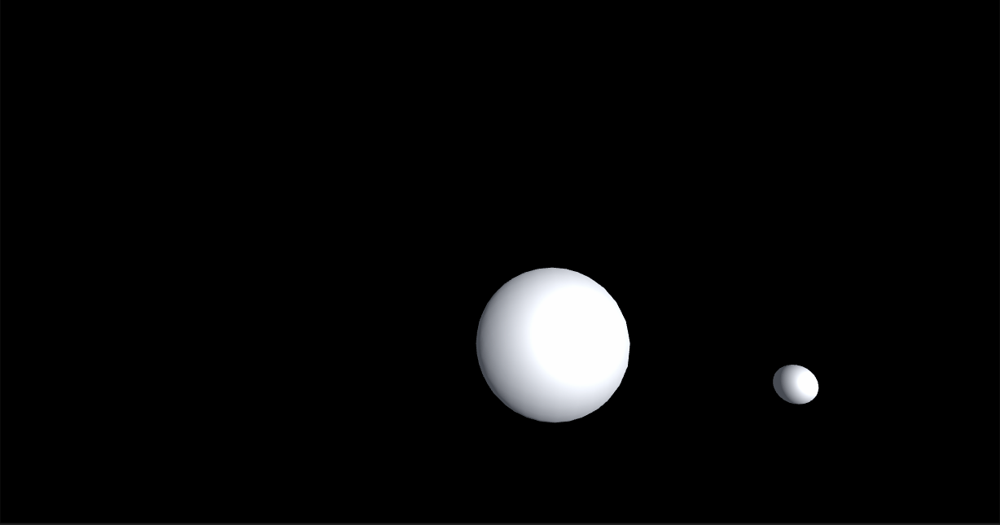

<!-- $theme: default -->

Compute Shader 入门精要
===

# 

##### Optimize your game using compute shader

###### **凯奥斯**
<!--
page_number: true
-->

---

Compute Shader 入门精要
===

- 概念
- 语法
- 用途

---

概念
===
## GPGPU（General Purpose Computing on GPU）

# 

---
概念
===
## CPU是基于低延迟的设计
# 
CPU擅长逻辑控制和串行的运算。

---
概念
===
## GPU是基于大吞吐量的设计
# 
GPU适用于计算密集型和易于并发的程序。

---
概念
===
## 支持Compute Shader的图形API
#   
#  
#  

---
概念
===
## Compute管线与图像管线的对比
# 

---
概念
===
## 渲染管线（硬件端）
# 

---
概念
===
## 计算管线（硬件端）
# 
Compute Shader可以在不通过渲染管线的情况下，利用GPU完成一些与图像渲染不直接相关的工作。

---
语法
===
## Dispatch
``` C#
public void Dispatch(int kernelIndex, 
	int threadGroupsX, 
	int threadGroupsY, 
    int threadGroupsZ);
```

---
语法
===
## ShaderLab
``` ShaderLab
// test.compute
#pragma kernel FillWithRed

RWTexture2D<float4> res;

[numthreads(1,1,1)]
void FillWithRed (uint3 dtid : SV_DispatchThreadID)
{
    res[dtid.xy] = float4(1,0,0,1);
}

```

---
语法
===
## numthreads

# 

---
语法
===
## Buffer & Texture
| GPU Side | CPU Side |
|-----|-----|
|StructuredBuffer|ComputeBuffer|
|RWStructuredBuffer|ComputeBuffer|
|RWStructuredBuffer(counter)|ComputeBuffer(Counter)|
|RWByteAddressBuffer|ComputeBuffer(Raw)|
|AppendStructuredBuffer|ComputeBuffer(Append)|
|ConsumeStructuredBuffer|ComputeBuffer(Append)|
|RWTexture1D|RenderTexture|
|RWTexture2D|RenderTexture|
|RWTexture3D|RenderTexture|

---
语法
===
## groupshared

使用groupshared可以将一个变量标记为组内共享。

---
语法
===
## Barrier
当我们在不同线程访问同一个资源的时候，我们需要使用barrier来进行阻塞。
```
GroupMemoryBarrier 
GroupMemoryBarrierWithGroupSync  
DeviceMemoryBarrier
DeviceMemoryBarrierWithGroupSync 
AllMemoryBarrier 
AllMemoryBarrierWithGroupSync
```

---
语法
===
## Interlocked
原子操作，不会被县城调度机制打断。
```
InterlockedAdd
InterlockedAnd
InterlockedCompareExchange
InterlockedCompareStore
InterlockedExchange
InterlockedMax
InterlockedMin
InterlockedOr
InterlockedXor
```


---
语法
===
## 平台差异
- 如果数组越界，DX上会返回0，其它平台会出错。
- 如果定义与关键字/内置库函数相同的变量名，DX没有影响，其他平台会出错。
- 如果StructuredBuffer内结构的显存布局要与内存布局不一致，DX可能会转换，其他平台会出错。
- 未初始化的Buffer或Texture，在某些平台上会全部是0，但是另外一些可能是任意值，甚至是Nan。
- Metal不支持对纹理的原子操作，不支持对buffer调用GetDimensions。
- OpenGL ES 3.1只确保支持同时使用4个buffer（所以，我们需要将相关联的数据定义为结构体）。
- 在渲染管线中，部分平台只支持在片元着色器内访问StructuredBuffer。

---
语法
===
## 性能
- 尽量减少Group之间的交互
- 避免分支
- 使用[unroll]来打开循环
- GPU一次调用64（AMD）或32（NVIDIA）或16（Intel）个线程（SIMD Group），所以，尽量使numthreads的乘积是这个值的整数倍。（但是Mali不需要这种优化，metal可以通过api获取这个值）
- 避免回读

---
用途
===
## GPU粒子系统
# 
https://github.com/keijiro/KvantStream

---
用途
===
## GPU模拟
# 

---
用途
===
## 图像处理
# 

---
用途
===
## Look-up Texture
# 
# 

---
用途
===
## Tessellation
# 

---
用途
===
## 渲染管线优化
# 
Hiz Occ

---
用途
===
## GPU Driven Rendering Pipeline
# 

---
用途
===
## 还有很多很多……

---
引用
===
- http://www.cnblogs.com/biglucky/p/4223565.html
- https://www.youtube.com/watch?v=0DLOJPSxJEg
- https://arm-software.github.io/vulkan-sdk/basic_compute.html
- https://www.khronos.org/opengl/wiki/Compute_Shader
- https://docs.microsoft.com/en-us/windows/desktop/direct3d11/direct3d-11-advanced-stages-compute-shader
- https://docs.unity3d.com/Manual/class-ComputeShader.html
- https://static.docs.arm.com/100614/0302/arm_mali_gpu_opencl_developer_guide_100614_0302_00_en.pdf
- https://developer.apple.com/metal/
- https://forum.unity.com/threads/compute-shaders.148874/
---
引用
===
- https://github.com/keijiro/KvantStream
- https://www.shpakivnia.com/cloth-tool
- http://www.codinglabs.net/tutorial_compute_shaders_filters.aspx
- https://developer.nvidia.com/gpugems/GPUGems2/gpugems2_chapter23.html
- https://www.nvidia.cn/coolstuff/demos#!/geforce-gtx-600/nalu
- https://www.nvidia.com/object/tessellation.html
- https://zhuanlan.zhihu.com/p/47615677
- http://advances.realtimerendering.com/s2015/aaltonenhaar_siggraph2015_combined_final_footer_220dpi.pdf