<!-- $theme: gaia
template: invert-->
<!--page_number: true-->
<!--footer: 凯奥斯 -->
<!-- $size: 16:10 -->

# Compute Shader

# 

##### Optimize your game using compute

###### **凯奥斯**
<!--
这个题目来源于AMD在4C上的一个演讲
Compute Shaders: Optimize your engine using compute
-->

---

# Compute Shader

- 概念
- 语法
- 用途
<!--

-->

---

## 概念
###### 介绍一下背景知识
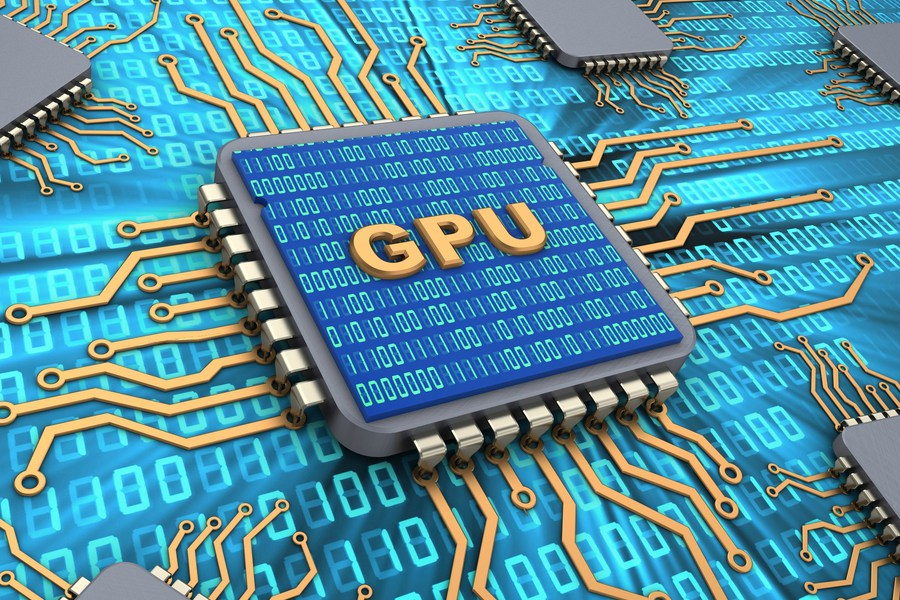
<!--
Compute Shader是在GPU上运行的程序。虽然是老生常谈了，但是我们还是要先介绍一下GPU。
众所周知，CPU和GPU是两种不同的架构，那么他们之间的区别是什么？[1]
-->

---
### CPU是基于低延迟的设计
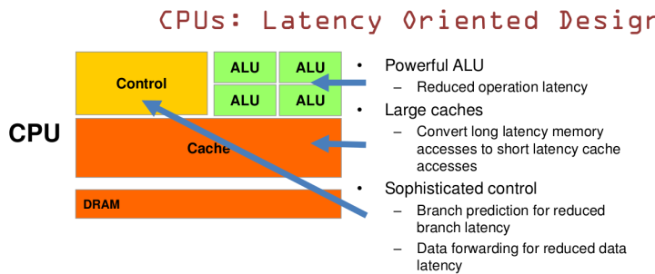
CPU擅长逻辑控制和串行的运算。

<!--
有很强大算术逻辑单元，减少操作延迟
巨大的cache，内存访问延迟大，空间换时间
复杂的控制器，使用分支预测来减少分支延迟，使用数据转发减少数据延迟
[1]
-->

---
### GPU是基于大吞吐量的设计
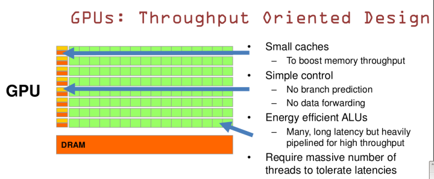
GPU适用于计算密集型和易于并发的程序。
<!--
小的cache，用来促进吞吐量
简单的控制，没有分支预测和数据转发
高效节能的ALU，很多延迟很长的ALU，但是为了高吞吐量被重度管线化
（需要大量的线程来容忍延迟）开启大量的线程，可以降低延迟
[1][2]
[27]
-->

---

### GPGPU

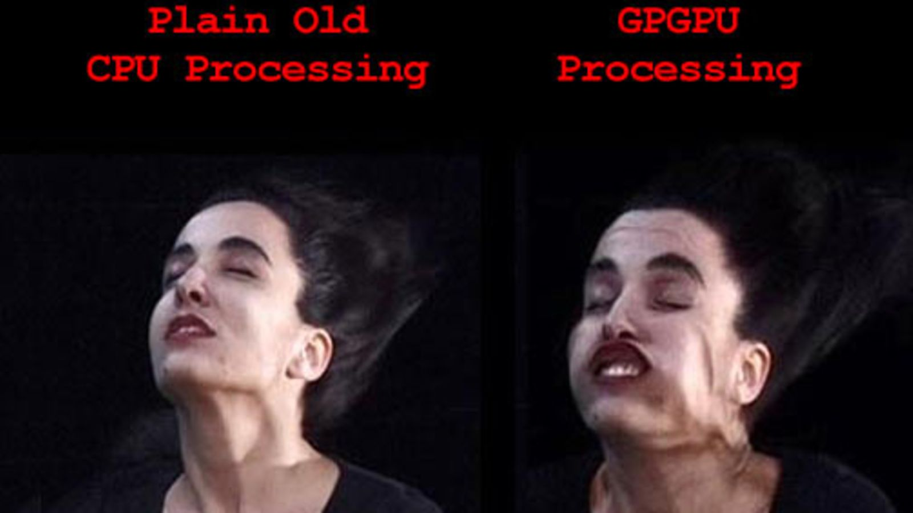
<!--
可以看出，CPU和GPU各有自己的擅长，那么我们可以将二者结合起来，使用CPU做串行，而使用GPU做并行。[1]
这种技术就叫做GPGPU，也就是利用GPU进行通用计算的技术
（General Purpose Computing on GPU）
通常来讲，GPU是用来执行图形渲染的。
为了执行通用计算，NV推出了CUDA，Khronos推出了OpenCL，Microsoft推出了DirectCompute，也就是后来的Compute Shader，后面各种图形API也相继推出了CS。

[25]

-->

---
### 支持Compute Shader的图形API
  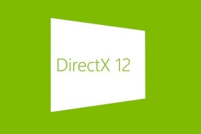
 
 
<!--DX虽然从10开始支持Compute Shader/Direct Compute，但是限制比较大。[6]
11支持了更强大的Compute Shader[6]，当然肯定还有DX12。
所以我们一般在Unity中使用CS，还是要求shader target4.5（也就是shader model 5）[19]
OpenGL从4.3开始支持CS，但是MacOSX不支持4.3[5][19]
ES从3.1开始支持CS[5][19]
Metal和Vulkan都支持CS[4][7][19]
另外PS4和Xbox one（DX11.2）也支持CS[19]
-->

---
### Compute管线与图形管线的对比
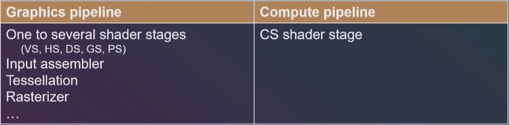
<!--
我们可以看到，计算管线变得很简单
[3]
（其实还少一个Output Merger Stage）
关于GPU Rendering Pipeline，可以参考这张图 https://github.com/ecidevilin/Blogs/blob/master/IntroTo3DGPWithDX/Tessellation/pic/pipeline.jpg
[14]
-->

---
### 图形管线（硬件端）
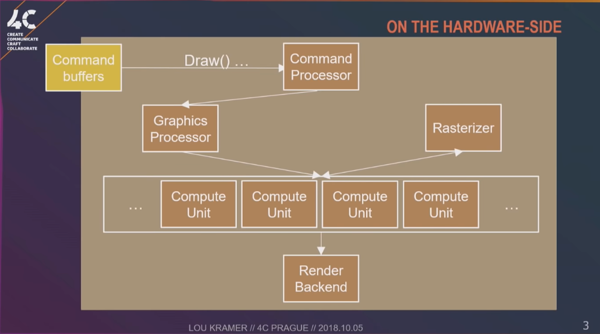
<!--
在硬件端的区别
[3]
-->

---
### 计算管线（硬件端）
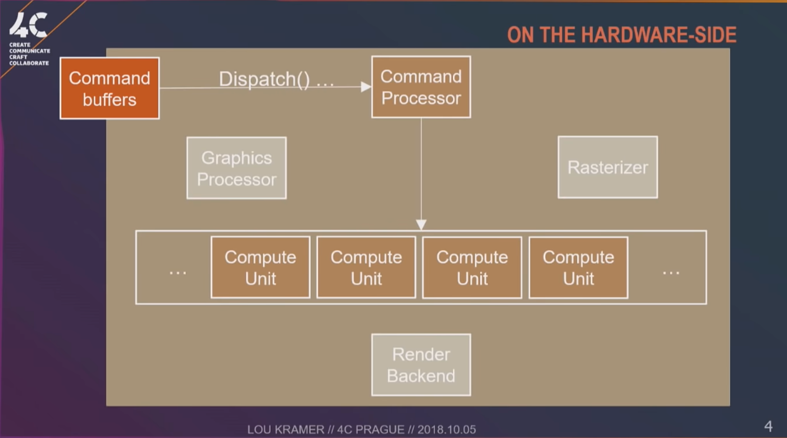

<!--Compute Shader可以在不通过渲染管线的情况下，利用GPU完成一些与图像渲染不直接相关的工作。这样就可以降低硬件的overhead。
[3]
-->

---
## 语法
##### 如何在Unity里使用Compute Shader

<!--
各种API的shading language语法和API各不相同
Unity的ShaderLab采用了跟HLSL接近的API
方便我们编写shader
-->

---
### kernel
``` ShaderLab
// test.compute
#pragma kernel FillWithRed

RWTexture2D<float4> res;

[numthreads(8,8,1)]
void FillWithRed (uint3 dtid : SV_DispatchThreadID)
{
    res[dtid.xy] = float4(1,0,0,1);
}

```
<!--
一个简单的Compute Shader示例，将一个RT填充成红色。
首先声明了一个Kernel，Kernel相当于一个main函数，是CS的入口。
来源于Metal的思路[7]，可以在一个资源文件里定义不同的kernel方法，公用一些代码，同时也可以做到相对独立。
然后声明了一个RWTexture2D，对应于C#，是RenderTexture。
在函数名上面还有一个numthreads的attribute，这个我们后面会讲到。
函数的参数后面带有一个Semantic，这个我们后面也会讲到。我们暂时可以把它当作一个坐标值。
最后是函数体，是将rt中的像素设置成红色。
[19]
-->

---
### Dispatch
``` C#
public void Dispatch(int kernelIndex, 
	int threadGroupsX, 
	int threadGroupsY, 
    int threadGroupsZ);
```
<!--
在CPU端，我们可以通过这个接口，将CS dispatch出去。
Dispatch就相当于Drawcall，但是没有draw。
kernelIndex可以通过ComputeShader.FindKernel来获取。
threadGroupsXYZ代表线程组的数量
[19]
-->


---
### numthreads
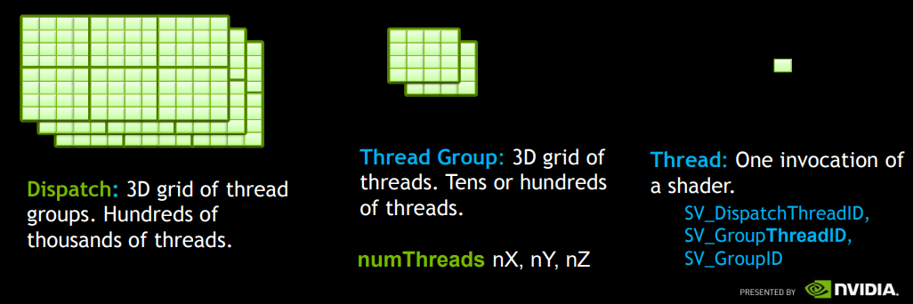
<!--
[2]
在CS里面，线程可以分为三个维度。
最右边的表示单个线程
最左边的表示一个dispatch
而图中间的，表示一个Thread Group。
thread group是指将多个线程组合成为一个group，在这个group里面，每个线程有自己的相对位置。group内，还可以使用共享变量，相互通信。
将numthreads这个attribute声明在kernel函数的前面，就表示一个thread group中有多少个thread。
如图所示
Dispatch 3x2x3
numthreads 4x4x2
这样做的好处一个是可以利用gpu的warp/wavefront/EU-thread[2][3]
另外，可以用来处理多种多样的图像压缩和解压缩；local size / thread group可以作为图像数据的一个block的大小（例如8x8）,group数量可以是图像的尺寸除以块的尺寸。每个块被当作一个单独的work group来处理[5]。
-->

---
### thread groups

<!--
[6]
上图代表了一个5x3x2的dispatch，图中的坐标代表一个thread group。
将2,1,0的TG打开，我们可以看到下面这张图。
这张图代表了一个10x8x3的thread group，图中的坐标代表了一个thread。
如图所示，我们可以根据这些坐标算出GroupThreadID，GroupID，DispatchThreadID和GroupIndex
各种id一般是用来作为索引来获取Buffer、Texture或者thread group shared memory里的数据[5]
-->

---
### Buffer & Texture
| GPU Side | CPU Side |
|-----|-----|
|\*StructuredBuffer|ComputeBuffer|
|RWTexture\*D|RenderTexture|
<!--
CS可以使用一些常规的类型，标量、向量、矩阵、纹理、数组等。
除此之外，为了更灵活的使用CS，还推出了StructuredBuffer，简称SBuffer。
当然，SBuffer在fs里也可以使用，在其他shader里也可能可以使用。
StructuredBuffer还包括
RWStructuredBuffer
RWStructuredBuffer with counter
(RW)ByteAddressBuffer
AppendStructuredBuffer
ConsumeStructuredBuffer
StructuredBuffer除了可以包含各种内置的类型之外
还可以包含自定义的struct
[5][6]
-->

---
### groupshared

使用groupshared可以将一个变量标记为组内共享（又叫TGSM）。
使用这种变量，就可以在thread group内进行通讯。
<!--
[2][6]
[5]
例如，我们可以在forward+/Deferred管线里使用compute shader对点光源进行剔除。
这个是在战地3中使用的技术。
[16][21]
-->

---
### Barrier
当我们在不同线程访问同一个资源的时候，我们需要使用barrier来进行阻塞和同步。
```
GroupMemoryBarrier 
DeviceMemoryBarrier
AllMemoryBarrier 
```
```
DeviceMemoryBarrierWithGroupSync 
GroupMemoryBarrierWithGroupSync  
AllMemoryBarrierWithGroupSync
```
<!--
[6]
GroupMemoryBarrier等待对groupshared变量的访问
DeviceMemoryBarrier等待对texture或buffer的访问
AllMemoryBarrier是以上两者的和
*WithGroupSync版本是需要同步到当前指令
-->

---
### Interlocked
原子操作，不会被线程调度机制打断。
```
InterlockedAdd
InterlockedAnd
InterlockedCompareExchange
InterlockedCompareStore
InterlockedExchange
InterlockedMax
InterlockedMin
InterlockedOr
InterlockedXor
```
*但是只能用于int/uint*
<!--
[6]
例如可以用于计算灰度直方图，用于Tonemapping\Auto Exposure等效果。
[19]
-->


---
### 平台差异
1. **数组越界**，DX上会返回0，其它平台会出错。
2. 变量名与关键字/内置库函数**重名**，DX无影响，其他平台会出错。
3. 如果SBuffer内结构的显存布局要与**内存布局不一致**，DX可能会转换，其他平台会出错。
4. **未初始化**的SBuffer或Texture，在某些平台上会全部是0，但是另外一些可能是任意值，甚至是NaN。
5. Metal不支持**对纹理的原子操作**，不支持对SBuffer调用**GetDimensions**。
6. ES 3.1在一个CS里**至少支持4个SBuffer**（所以，我们需要将相关联的数据定义为struct）。
<!--
7. 在渲染管线中，部分号称支持es3.1+的Android手机**只支持在片元着色器内访问StructuredBuffer**。
[19]
-->

---
### 性能
1. 尽量减少Group之间的交互
2. GPU一次Dispatch会调用64（AMD）或32（NVIDIA）个线程，所以，numthreads的乘积最好是这个值的整数倍。
3. 避免回读
4. 避免分支，重点避免在thread group中间的分支
5. *尽量保证内存连续性*
6. *使用[unroll]来打开循环，有些时候需要手动unroll*
<!--
(1)硬件不支持全局同步[2]，不同步的话容易导致错误和崩溃[3]
(2)wavefront/warp/EU-thread实际上是一种SIMD技术，[2][3]
但是Mali不需要这种优化[8]
Metal可以通过api获取这个值[7]
(3)回读操作在渲染管线中使用的比较少，而在CS中可能会被用到，所以重点提一下。[20]
(4)如果是warp的整数倍，就还好[2][26]
剩下的一些Tips在渲染管线中也同样适用[22]
-->

---
## 应用
###### 目前有哪些应用


---
### GPU Particle System

<!--
图为用CS实现的GPU粒子系统
用CS计算粒子的运动轨迹
[10]
-->

---
### GPU Simulation
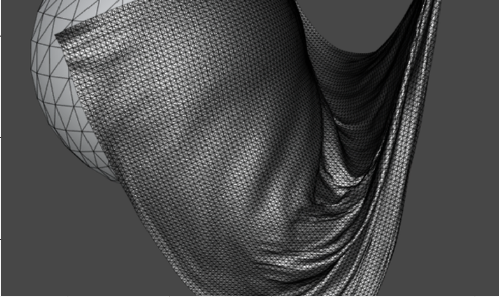
<!--
图为布料模拟，使用了CS进行粒子的受力运动计算、碰撞检测（反馈）和约束计算
类似的还有头发模拟和海水模拟
[11]
-->

---
### Image Processing
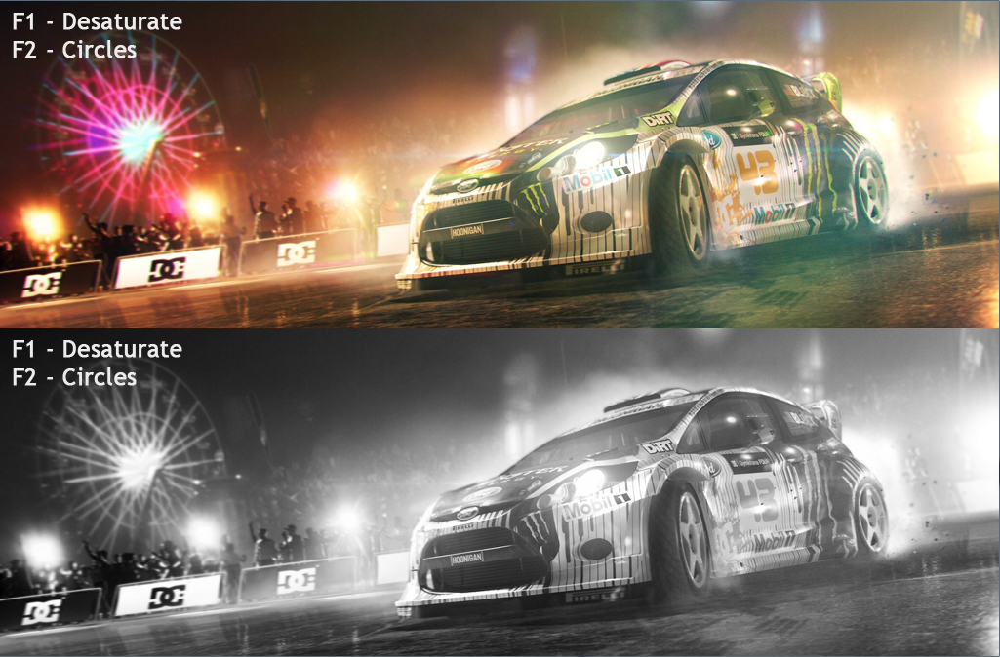
<!--
图为去色的图像处理[12]
rgb与(0.299,0.587,0.114)进行dot，获得灰度值[24]
类似的还有eye adaptation, color grading等等[3]
Unity的PPS2中使用的histogram就是一个很好的例子，用到了CS的很多语法。[23]
-->

---
### Image Compression

<!--
4x4 6x6 8x8
[13]
上面提到过，我们可以使用CS来实现基于Block的纹理压缩算法。
-->


---
### Tessellation

<!--
[15]
默认管线中的Tessellation比较受限，可以使用Displacement mapping来提升它的效果。
不过配合CS一起使用，我们可以配合一些逻辑更自由更动态的生成细分顶点。
[14][3]
-->

---
### Local lights culling


<!--
战地3中，使用了Deffered shading pipeline，通过cs对点光源、探照灯等光源进行剔除
[16]
-->

---
### Occlusion culling
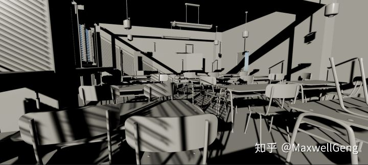

<!--Hiz Occ
图片来源，知乎大V MaxwellGeng实现的GPU Occlusiong Culling
他使用了Hiz的方法，对cluster进行遮挡剔除。
而这种思想就是GPUDRP。
[17]
-->

---
### GPU Driven Rendering Pipeline

<!--
图为刺客信条大革命，在这部游戏中使用了GPUDRP技术，并在Siggraph 2015: Advances in Real-Time Rendering in Games course中发表
[18]
-->

---
### 还有很多很多……

---
### Simple, but not easy.

<!--
ES从3.1开始支持CS[5][19]，也就是说，在手机上的支持率并不是很高。[3]
另外，手机算力还是很低。
floating point operations per second
GTX 1050 Ti的算力是1.9k~2.9k Gflops，有768个core
华为P20的Mali-G72 MP12的算力是300+ Gflops，只有12个core
所以，CS在手机上的使用，是困难的，但是有巨大潜力的。
[28]
-->

---
## 引用
1. [Graphic Processing Processors (GPUs) Parallel Programming](https://slideplayer.com/slide/9636742/)
2. [DirectCompute
Optimizations and Best Practices](http://on-demand.gputechconf.com/gtc/2010/presentations/S12312-DirectCompute-Pre-Conference-Tutorial.pdf)
3. [Compute Shaders: Optimize your engine using compute / Lou Kramer, AMD (video)](https://www.youtube.com/watch?v=0DLOJPSxJEg)
4. [Introduction to Compute Shaders in Vulkan](https://arm-software.github.io/vulkan-sdk/basic_compute.html)
5. [Compute Shader(OpenGL)](https://www.khronos.org/opengl/wiki/Compute_Shader)
6. [Compute Shader Overview(Direct3D 11)](https://docs.microsoft.com/en-us/windows/desktop/direct3d11/direct3d-11-advanced-stages-compute-shader)
---
## 引用
7. [About Threads and Threadgroups(Metal)](https://developer.apple.com/documentation/metal/about_threads_and_threadgroups)
8. [ARM® Mali™ GPU OpenCL Developer Guide(Version 3.2)](https://static.docs.arm.com/100614/0302/arm_mali_gpu_opencl_developer_guide_100614_0302_00_en.pdf)
9. Real-Time Rendering 3rd Edition. Chapter 18
10. [GPU Particles (Github)](https://github.com/Robert-K/gpu-particles)
11. [GPU Cloth Tool](https://www.shpakivnia.com/cloth-tool)
12. [Compute Shader Filters](http://www.codinglabs.net/tutorial_compute_shaders_filters.aspx)
13. [Adaptive Scalable Texture Compression](https://en.wikipedia.org/wiki/Adaptive_Scalable_Texture_Compression)
---
## 引用
14. Introduction to 3D Game Programming with DirectX 11
15. [DirectX 11 Tessellation (NVIDIA)](https://www.nvidia.com/object/tessellation.html)
16. [DirectX 11 Rendering in Battlefield 3](https://www.slideshare.net/DICEStudio/directx-11-rendering-in-battlefield-3)
17. [Hi-Z GPU Occlusion Culling](https://zhuanlan.zhihu.com/p/47615677)
18. [GPU-Driven Rendering Pipelines](http://advances.realtimerendering.com/s2015/aaltonenhaar_siggraph2015_combined_final_footer_220dpi.pdf)
19. https://docs.unity3d.com
20. [Problems with ComputeBuffer Readback](https://forum.unity.com/threads/compute-shaders.148874/#post-1021917)
21. [Volume Tiled Forward Shading (Github)](https://github.com/jpvanoosten/VolumeTiledForwardShading)
---
## 引用
22. Low-level Shader Optimization for Next-Gen and DX11 [(ppt)](http://www.humus.name/Articles/Persson_LowlevelShaderOptimization.pptx) [(video)](https://www.gdcvault.com/play/1020352/Low-Level-Shader-Optimization-for)
23. [Post-processing Stack v2 (Github)](https://github.com/Unity-Technologies/PostProcessing)
24. 数字图像处理（冈萨雷斯）
25. [General-purpose computing on graphics processing units (Wikipedia)](https://en.wikipedia.org/wiki/General-purpose_computing_on_graphics_processing_units)
26.  全局光照技术：从离线到实时渲染
27.  [Mythbusters Demo GPU versus CPU ( NVIDIA )](http://v.youku.com/v_show/id_XNjY3MTY4NjAw.html)
28.  [Glops](https://gflops.surge.sh/)